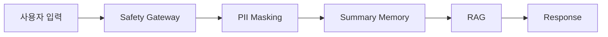

# 심리 상담 AI Agent

2030 청년층의 고립감, 불안, 우울 표현을 감지하고 24시간 정서적 지지를 제공하는 상담 보조 에이전트입니다. 이 프로젝트는 전문 상담사를 대체하지 않으며, 감정 정리, 위험 신호 탐지, 위기 시 전문기관 연결을 돕는 안전 중심 시스템입니다.

## 프로젝트 목적

이 에이전트의 목적은 다음과 같습니다.

- 사용자의 감정 표현을 이해하고 공감형 답변을 제공한다.
- 자살, 자해, 폭력, 급성 위기 표현을 탐지한다.
- 위험 단계는 관심, 주의, 위험으로 분류한다.
- 고위험 입력이 들어오면 109, 119, 112 같은 긴급 도움을 우선 안내한다.
- AI가 의료 진단이나 치료를 하지 않는다는 점을 분명히 한다.
- 개인정보는 최소 수집 원칙을 따르고, 대화 원문을 학습하지 않으며, 개인정보 마스킹 후 요약 메모리만 사용한다.

## 폴더 구조

```text
Psychologist_Agent-main/
├── configs/            # 실행과 학습 설정
├── data/               # 원천/가공/안전/지식 데이터
│   ├── raw/            # 원본 입력 데이터
│   ├── processed/      # 전처리 결과
│   ├── crisis/         # 위기 안내 문구와 리소스
│   ├── safety/         # 위험 패턴과 안전 응답
│   ├── knowledge/      # CBT/DBT/WHO 지식 자료
│   └── vectordb/       # RAG용 벡터 저장소
├── demo/               # Gradio 데모
├── models/             # 로컬 GGUF 모델 저장 위치
├── notebooks/          # 학습/평가 노트북
├── prompts/            # 상담용 프롬프트 템플릿
├── scripts/            # 데이터 전처리와 평가 스크립트
├── src/                # 핵심 애플리케이션 코드
└── tests/              # 기본 동작과 안전성 테스트
```

## 핵심 동작 방식

이 프로젝트는 다음 흐름으로 동작합니다.

1. 사용자 입력 수신
2. 안전 게이트웨이로 자살, 자해, 폭력성 표현을 우선 탐지
3. 개인정보를 마스킹한 뒤 요약 메모리에 저장
4. RAG로 CBT, DBT, WHO 자료를 참조
5. 위험 단계에 따라 공감 응답 또는 위기 안내 생성
6. 응답 뒤에는 의료 진단 아님과 전문기관 연결 안내를 포함



위험 단계는 다음과 같이 해석합니다.

- 관심: 일반적인 스트레스, 가벼운 걱정, 감정 정리 지원 수준
- 주의: 지속적인 불안, 우울, 고립, 무기력, 악화 가능성이 있는 상태
- 위험: 자해, 자살, 폭력, 즉각적인 안전 조치가 필요한 상태

## 실행 방법

### 1. 설치

```bash
pip install -r requirements.txt
```

### 2. 환경 변수 설정

`.env` 파일을 만들고 필요한 값을 넣습니다.

```env
DEEPSEEK_API_KEY=your_api_key_here
DEEPSEEK_BASE_URL=https://api.deepseek.com/v1
LLM_TYPE=MOCK
```

## Android 앱 개요

Android 클라이언트는 Python 상담 Agent를 휴대폰에서 쉽게 사용할 수 있도록 만든 전용 화면입니다.

- 상담 채팅 화면: 사용자가 입력한 내용을 Python API로 보내고, 위험 단계가 높으면 위기 안내 카드로 전환합니다.
- 오늘의 감정 체크 화면: 기분, 불안, 외로움, 수면, 식사 상태를 간단히 기록합니다.
- 위기 도움 화면: 109, 119, 112, 가까운 사람 연락, 긴급 연락처 확인을 직접 눌러서만 연결합니다.
- 긴급 연락처 등록: 가족, 친구, 상담센터 연락처를 사용자가 직접 등록합니다.
- 개인정보 보호: 대화 기록 저장 안 함, 직접 삭제, 앱 잠금/PIN 구조, 민감정보 마스킹을 지원합니다.

자세한 구조와 Android Studio 기준 실행 방법은 [android/README.md](android/README.md)를 참고하세요.

`LLM_TYPE=MOCK`는 로컬 테스트와 데모 실행에 적합합니다. 실제 모델을 사용할 때는 `LOCAL` 또는 `CLOUD` 설정을 사용합니다.

MOCK은 응답 생성 모드이고, 웰니스 데이터셋은 체크인 기반 support_hint 추천에 사용된다.

### 3. 데모 실행

```bash
python -m demo.app
```

### 4. CLI 실행

```bash
python src/main.py
```

### 5. 데이터 전처리

로컬 `data/raw`가 있으면 그 파일을 먼저 사용하고, 없으면 HuggingFace 데이터셋을 가져옵니다.

```bash
python scripts/data_preparation.py --raw-dir data/raw --output-dir data/processed
```

### 5-1. 웰니스 체크인 API 예시

```json
POST /api/v1/chat
{
	"message": "오늘 너무 지쳤어요.",
	"wellness_checkin": {"mood_score": 4, "anxiety_score": 6, "sleep_quality": 3}
}
```

### 6. DPO 평가용 응답 판정

```bash
python scripts/deepseek_judge.py --input data/baseline/responses.jsonl --output-dir data/dpo --mock
```

### 7. 테스트 실행

```bash
pytest -q
```

### 8. Android 앱 실행

1. Android Studio에서 [android/](android/) 폴더를 프로젝트로 엽니다.
2. Python 백엔드가 `http://10.0.2.2:8080/` 또는 실제 서버 주소에서 실행 중인지 확인합니다.
3. `android/app/src/main/java/com/psychologist/agent/AppConfig.kt`에서 `USE_MOCK_API` 값을 조정합니다.
4. 에뮬레이터 또는 실제 기기에서 앱을 실행합니다.

Android 쪽 세부 구현 설명은 [android/README.md](android/README.md)에 따로 정리해 두었습니다.

## 데이터셋 설명

### `data/raw`

원본 상담 대화나 외부 수집 데이터가 들어가는 위치입니다. 전처리 스크립트는 이 폴더의 `json`, `jsonl`, `csv` 파일을 우선적으로 읽습니다.

표준 웰니스 데이터 포맷과 샘플 데이터셋은 [docs/wellness_dataset_format.md](docs/wellness_dataset_format.md)와 [data/raw/wellness_sample.jsonl](data/raw/wellness_sample.jsonl)을 참고하세요.
MOCK 모드에서도 웰니스 체크인 값이 있으면 샘플 웰니스 데이터셋의 support_hint를 참고해 응답을 보조한다.

본 프로젝트는 심리상담 데이터, 공감형 대화 데이터, 웰니스 데이터, 아동·청소년 상담데이터를 역할별로 분리해 사용한다. 위험 상황에서는 데이터셋 기반 응답보다 Safety Gateway와 crisis_response가 항상 우선한다.

### `data/processed`

정규화, 중복 제거, 길이 필터링이 끝난 학습용 데이터입니다.

### `data/knowledge`

공감형 상담 응답을 돕기 위한 지식 자료입니다.

- `cbt_techniques.md`
- `dbt_skills.md`
- `who_preventing_suicide.md`

### `data/safety`

위험 패턴과 안전 응답 템플릿이 들어 있습니다.

### `data/crisis`

위기 상황에서 사용할 안내 문구와 지역별 리소스가 들어 있습니다.

## 안전 정책

이 프로젝트는 안전을 최우선으로 둡니다.

- 자살, 자해, 폭력, 급성 위기 신호가 있으면 즉시 안전 안내를 우선합니다.
- AI는 의료 진단, 약물 처방, 치료 지시를 하지 않습니다.
- 개인정보는 최소 수집만 하며, 대화 원문은 학습이나 보존에 쓰지 않고 개인정보 마스킹 후 요약 메모리만 사용합니다.
- 위기 상황에서는 109, 119, 112, 988, 911 등의 긴급 도움을 안내할 수 있습니다.
- 사용자에게 과도한 확신을 주는 표현을 피하고, 사람의 도움을 연결하는 방향으로 답변합니다.

## 한계점

- 이 시스템은 전문 상담사를 대체하지 않습니다.
- 한국어 표현과 은어는 계속 확장해야 합니다.
- 실제 위기 대응은 지역, 기관, 상황에 따라 다르므로 안내 문구를 운영 환경에 맞게 조정해야 합니다.
- 로컬 모델 품질은 GGUF 모델과 하드웨어 성능에 크게 좌우됩니다.
- RAG 자료와 안전 패턴은 정기적으로 갱신해야 합니다.

## 개발 메모

- MOCK 모드에서는 외부 API 없이도 테스트할 수 있습니다.
- 로컬 저장을 활성화하려면 `MemoryStore`와 세션 설정을 명시적으로 구성해야 합니다.
- 핵심 로직은 `src/main.py`, `src/safety/`, `src/audit/`, `src/prompt/`에 있습니다.

## 라이선스 및 사용 주의

이 저장소의 코드는 교육, 연구, 프로토타이핑 목적으로 사용해야 합니다. 실제 심리 응급 상황이 의심되면 AI와의 대화보다 즉시 지역 응급 서비스와 전문기관을 우선해야 합니다.
